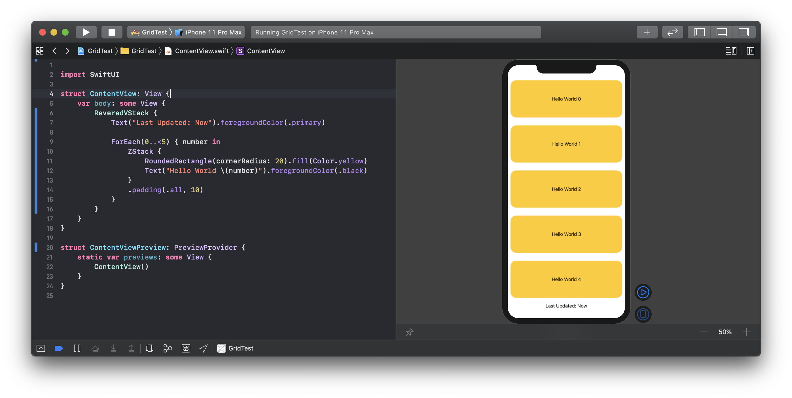

# VariadicViewBuilder
Custom View Builder that allows you to build custom layouts...

If you want to build a view that can layout it's children, you need to get them as an array.
That's where `@VariadicViewBuilder`. It's a function builder that allows you to get an array of views, but with the same API look as a regular `@ViewBuilder`.

And the important thing is that it automatically deals with `ForEach` and similar Views, just like `HStack` and `VStack` already do. So you can provide an API that is consistent with Apple's. 

## Example

If you wanted to for instance build `ReversedVStack` that. A VStack that is rendered backwards. You use `@VariadicViewBuilder` to get an array of `AnyView`s:

```swift
struct ReveredVStack: View {
    private let content: [AnyView]

    init(@VariadicViewBuilder content: () -> [AnyView]) {
        self.content = content()
    }

    var body: some View {
        let reversed = content.reversed()
        return VStack {
            ForEach(reversed.indices, id: \.self) { index in
                reversed[index]
            }
        }
    }
}
```

You can then use this view, however you like. For example:



## Installation
### Swift Package Manager

You can install VariadicViewBuilder via [Swift Package Manager](https://swift.org/package-manager/) by adding the following line to your `Package.swift`:

```swift
import PackageDescription

let package = Package(
    [...]
    dependencies: [
        .package(url: "https://github.com/nerdsupremacist/VariadicViewBuilder.swift.git", from: "0.1.0"),
    ]
)
``` 

## Known issues

- Due to [SR-11628](https://bugs.swift.org/browse/SR-11628) using this function builder with a single View will not compile
    - This should be fixed by April 30th, 2020 with Swift 5.3

## Contributions
Contributions are welcome and encouraged!

## License
VariadicViewBuilder is available under the MIT license. See the LICENSE file for more info.
